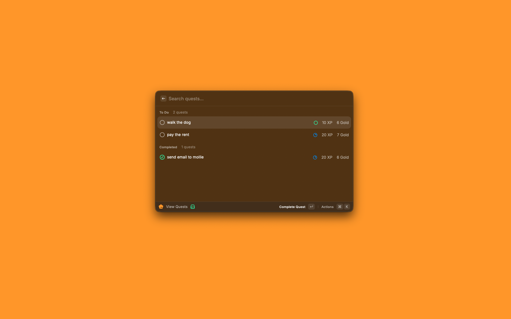

# Marcel for Raycast

Manage your Marcel quests from Raycast.



## Features

- Create new quests with custom difficulty and status
- View and organize quests by status (To Do, In Progress, Completed)
- Complete quests and earn XP/Gold rewards
- Change quest status with quick actions
- Delete quests with confirmation
- Search and filter quests instantly
- Cached data with optimistic updates

## Setup

1. Get your Marcel API token from https://marcel.my
2. Install and configure:

```bash
npm install
npm run dev
```

3. Enter your API token in extension preferences (`⌘` + `,`)

## Usage

Open Raycast, type "View Quests", and:
- `⌘` + `N` to create a new quest
- `⌘` + `Return` to complete a quest
- `Ctrl` + `X` to delete a quest
- Use Actions menu to change status
- Search to filter quests instantly

## Development

```bash
npm run dev          # Development mode
npm run build        # Production build
npm run lint         # Check code style
npm run publish      # Publish to Raycast Store
```

## License

MIT
